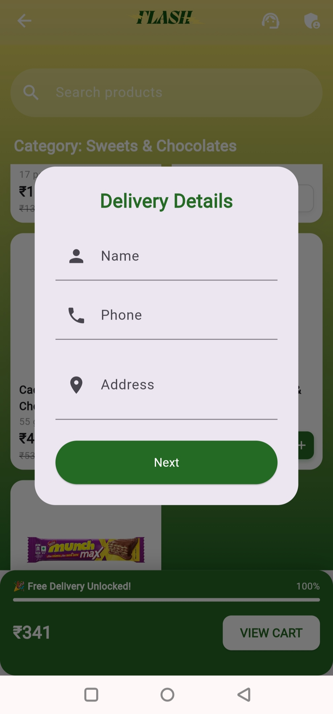

FlashCart  

A Modern Grocery Delivery Platform

> Full-stack grocery delivery application built with Flutter & Supabase.  
> Designed for real-time order management, scalable backend integration, and smooth cross-platform performance.

---

## ✨ Overview

FlashCart is a production-ready grocery delivery system supporting both **customers** and **administrators**.

It focuses on:
- Clean UI
- Secure backend integration
- Real-time database updates
- Structured order workflow
- Scalable architecture

---

## 🚀 Core Features

### 👤 Customer Side
- Browse products by category
- Smart search functionality
- Add to cart & manage quantities
- Delivery area validation
- Seamless checkout flow

### 🛠 Admin Dashboard
- Real-time order tracking
- Order status management
- Store open/close toggle
- Database-driven product control

---

## ⚙️ Tech Stack

| Layer        | Technology Used |
|--------------|-----------------|
| Frontend     | Flutter (Web & Mobile) |
| Backend      | Supabase (Auth + PostgreSQL) |
| Hosting      | Firebase Hosting |
| Notifications| Pushbullet API |

---

## 🔐 Security Architecture

- API keys secured using `dart-define`
- Sensitive credentials removed from source control
- Supabase Edge Functions for secure server operations

---

## 🌍 Live Demo

🔗 https://flash-cart-2025.web.app

---

## 🧠 What This Project Demonstrates

- Full-stack integration (Flutter + Supabase)
- State management & async handling
- Real-time database streaming
- Secure environment configuration
- Deployment workflow (Firebase Hosting)

---

## 👨‍💻 Developer

**Sudharsan Ramesh**  
Flutter Developer | UI/UX Enthusiast | Backend Integration  | 3D Artist | E-Commerce Associate | Frontend Developer 

---

---

## 📸 Application Screenshots

### 🏠 Landing Page

### 🛍 Home Screen

### 🛒 Products

### 📦 Delivery

### ✅ Order Confirmation

### 🎉 Order Placed

### 📑 Orders Overview

---

## 🛠 Admin Dashboard

### 🔐 Manager Login

### 📊 Manager Panel

### 🗂 Orders Tab

---

⭐ If you found this project interesting, feel free to explore the code!
